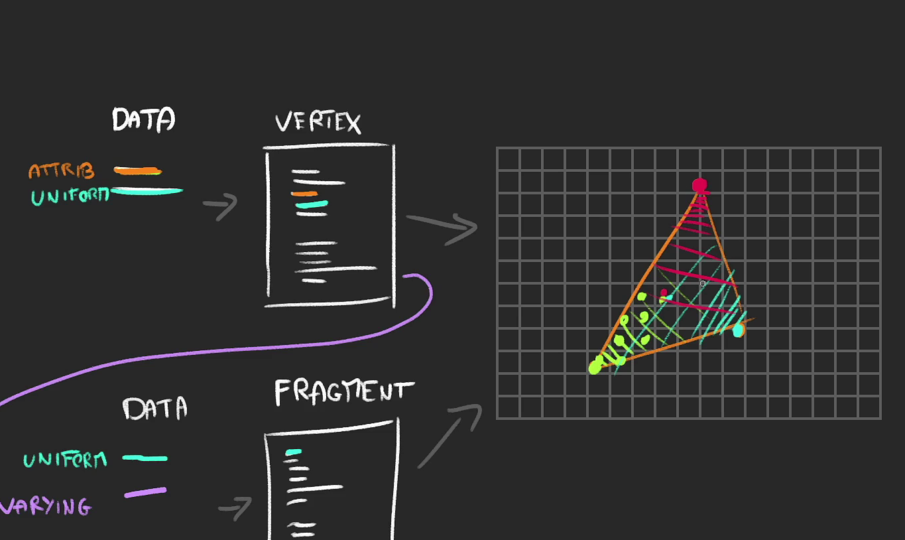

# Shader
shader is a program written in glsl sent to the gpu it contain position of the vertex and color of the each pixel

we are going to send two program 
- vertex shader 
  - contain position of each vertex
- frament shader 
  - contain information like color of each pixel 

But pixel isn't perfect for all computer so it is called fragment

### We send data like
- Vertices Coordinate 
- Mesh Coordinate
- Information about the camera
- Color
- Texture
- Light
- Fog

We are going to send all these data to the shader the follow the current camera moment of get affect by light and Mesh position

There are two type of shader we need to learn 
- Vertex Shader
- Frament Shader

## Terminology
### Attribute
- Same Program will be used to draw each vertices Some data like vertex position will be different for each vertex those type of data are called attributes

### Uniform
- Some data like position of the mesh is same for each vertex Those type of data are called Uniform.

Once you placed vertex shader the gpu knows which pixel are visible inside the geometry then gpu used frament shader to color each pixel

- Vertex shader has both uniform and attribute
- Fragment shader only has uniform

### Varying
We can send data from vertex shader to fragment shader that is called varying when we have different value for each vertex the value get interpolated between itself

## Why writing own shader 
- Good for performance 
- Three shader are limited 

## Two type of shader material
- Raw shader material 
  - From the scarch
- Shader material
  - Three js provide some code automatically

  ## Rawshader 
First we will see raw shader material. we can write program in the single quote we can't add new line by this way

Or we can use `` to overcome this problem 

But we are going to write a new program in new file
